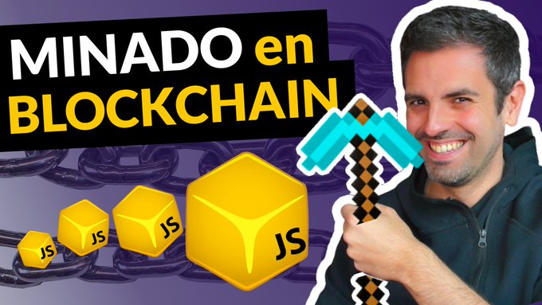

# 🧱⛏ Tu Propia Blockchain en JavaScript - Minado  

>Aprende como funciona una blockchain creando la tuya propia desde cero con JavaScript

Código del ejemplo que se ve en el vídeo de Youtube [Cómo minar tu propia Blockchain](https://www.youtube.com/watch?v=z6oYEYtMLbo)

